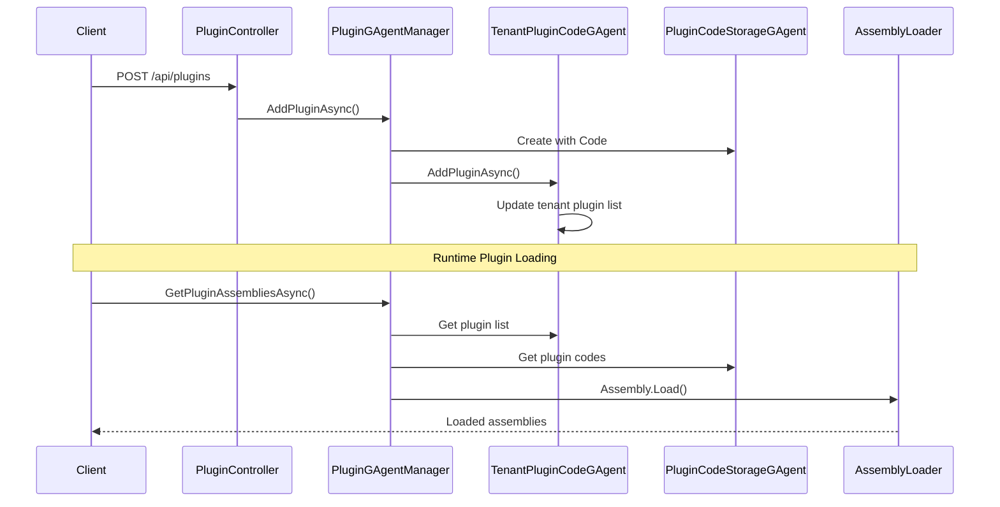

# Plugins

## Introduction

The Aevatar Plugin System is a dynamic code loading and management based on GAgent architecture, supporting plugin isolation and updates in multi-tenant environments. The core value of this system lies in providing a secure, scalable plugin ecosystem.

**Core Values:**
- 🏢 **Multi-tenant Isolation**: Each tenant has an independent plugin space
- 🔒 **Security Sandbox**: Plugins execute in a controlled environment
- 📦 **Version Management**: Supports plugin version control and rollback

**Business Problems Solved:**
1. **Multi-tenant Feature Differentiation**: Different tenants can have customized functional modules
2. **System Scalability Limitations**: Prevents core system over-expansion by implementing feature extensions through plugins

## Usage

**Step 1: Create your own GAgent project and complete code development**

**Step 2: Compile to generate DLL**

```bash
# Compile plugin project
dotnet build --configuration Release

# Generated DLL location
# ./bin/Release/net8.0/MyCustomPlugin.dll
```

**Step 3: Upload plugin via API**

```bash
# Upload plugin DLL using curl
curl -X POST "https://your-aevatar-server/api/plugins" \
  -H "Authorization: Bearer YOUR_TOKEN" \
  -H "Content-Type: multipart/form-data" \
  -F "ProjectId=YOUR_TENANT_ID" \
  -F "Code=@./bin/Release/net8.0/MyCustomPlugin.dll"
```

### Configuration Parameters

```csharp
// appsettings.json
{
  "Plugins": {
    "TenantId": "cd6b8f09214673d3cade4e832627b4f6",
    "ConnectionString": "mongodb://localhost:27017/AevatarDb"
  },
}
```

### API Interface Documentation

| Interface | Method | Path | Description |
|-----------|--------|------|-------------|
| Get Plugin List | GET | `/api/plugins` | Get plugin list for specified project |
| Create Plugin | POST | `/api/plugins` | Upload and create new plugin |
| Update Plugin | PUT | `/api/plugins/{id}` | Update code for specified plugin |
| Delete Plugin | DELETE | `/api/plugins/{id}` | Delete specified plugin |

## How It Works

### Core Modules Involved

1. **PluginGAgentManager**: Plugin lifecycle manager
2. **TenantPluginCodeGAgent**: Tenant-plugin association management
3. **PluginCodeStorageGAgent**: Plugin code storage management
4. **PluginLoader**: Dynamic assembly loader

### Key Technology Stack

- **Orleans GAgent**: Provides distributed state management and event sourcing
- **Assembly Dynamic Loading**: .NET Assembly.Load mechanism
- **Multi-tenant Architecture**: Data isolation based on TenantId
- **Event Sourcing**: Complete tracking of plugin state changes

### Core Code

**1. Plugin Manager Core Logic:**

```csharp
public async Task<Guid> AddPluginAsync(AddPluginDto addPluginDto)
{
    if (addPluginDto.Code.Length == 0)
    {
        return Guid.Empty;
    }

    var pluginCodeGAgent = await _gAgentFactory.GetGAgentAsync<IPluginCodeStorageGAgent>(
        configuration: new PluginCodeStorageConfiguration
        {
            Code = addPluginDto.Code
        });
    var pluginCodeId = pluginCodeGAgent.GetPrimaryKey();
    var tenant = await _gAgentFactory.GetGAgentAsync<ITenantPluginCodeGAgent>(addPluginDto.TenantId);
    await tenant.AddPluginAsync(pluginCodeId);
    return pluginCodeId;
}
```

**2. Plugin Loader Implementation:**

```csharp
public static class PluginLoader
{
    public static List<byte[]> LoadPlugins(string pluginsDirectory)
    {
        var pluginCodeList = new List<byte[]>();

        if (Directory.Exists(pluginsDirectory))
        {
            var dllFiles = Directory.GetFiles(pluginsDirectory, "*.dll");

            foreach (var dllFile in dllFiles)
            {
                var bytes = File.ReadAllBytes(dllFile);
                pluginCodeList.Add(bytes);
            }
        }

        return pluginCodeList;
    }
}
```

**3. Dynamic Assembly Loading:**

```csharp
public async Task<IReadOnlyList<Assembly>> GetPluginAssembliesAsync(Guid tenantId)
{
    var assemblies = new List<Assembly>();
    var pluginCodeGAgentPrimaryKeys =
        await _tenantPluginCodeRepository.GetGAgentPrimaryKeysByTenantIdAsync(tenantId);
    if (pluginCodeGAgentPrimaryKeys == null) return assemblies;
    var pluginCodes =
        await _pluginCodeStorageRepository.GetPluginCodesByGAgentPrimaryKeys(pluginCodeGAgentPrimaryKeys);
    assemblies = pluginCodes.Select(Assembly.Load).DistinctBy(assembly => assembly.FullName).ToList();
    return assemblies;
}

public async Task<IReadOnlyList<Assembly>> GetCurrentTenantPluginAssembliesAsync()
{
    var tenantId = _pluginsOptions.TenantId;
    if (tenantId == Guid.Empty)
    {
        return [];
    }

    return await GetPluginAssembliesAsync(tenantId);
}
```

### Plugin Loading Flow



## Best Practices

- Implement standard IGAgent interface
- Use event sourcing pattern for state management
- Avoid global state and static variables
- Implement proper error handling and logging