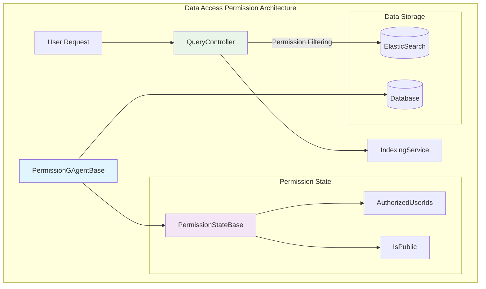

# Permission

The permission management system consists of two core components: **GAgent Access Permissions** and **Data Access Permissions**.

## 2.1 GAgent Access Permissions

### Introduction

GAgent Access Permissions is a fine-grained permission control system based on method-level access control. It performs permission verification during GAgent method calls through an interceptor pattern. The core value of this system lies in providing declarative permission control, where developers only need to mark methods with attributes to implement complex permission logic.

**Core Values:**
- 🎯 **Method-level Precise Control**: Supports permission declarations at both class and method levels
- 🔄 **Declarative Programming**: Simplifies permission control code through Attributes
- 🌐 **Distributed Support**: Maintains consistent permission verification in Orleans cluster environments
- 📊 **Audit Tracking**: Complete recording of permission checks and authorization processes

**Business Problems Solved:**
1. **Fine-grained Permission Control**: Traditional role permissions are too coarse and cannot meet complex business scenarios
2. **Code Intrusion**: Avoids scattering permission check logic throughout business code
3. **Distributed Permission Consistency**: Ensures permission control consistency in microservice environments
4. **Permission Management Complexity**: Simplifies permission definition and management processes

**Example Use Cases:**
- Enterprise ERP system functional permission control
- Multi-tenant SaaS platform user permission management
- API gateway interface access control
- Microservice inter-call permission verification

### Usage

```csharp
[Permission("UserManagement.View", GroupName = "UserManagement", DisplayName = "View Users")]
public class UserManagementGAgent : GAgentBase<UserState>, IUserManagementGAgent
{
    [Permission("UserManagement.Create", DisplayName = "Create User")]
    public async Task<bool> CreateUserAsync(CreateUserDto dto)
    {
        // Business logic, permission check is automatic
        return await CreateUserInternalAsync(dto);
    }
    
    [Permission("UserManagement.Delete", DisplayName = "Delete User")]
    public async Task<bool> DeleteUserAsync(Guid userId)
    {
        // Business logic
        return await DeleteUserInternalAsync(userId);
    }
}
```

### How It Works

**Core Modules Involved:**
1. **PermissionCheckFilter**: Orleans interceptor responsible for permission verification
2. **GAgentPermissionHelper**: Permission information scanning and management
3. **PermissionAttribute**: Permission declaration attribute
4. **UserContext**: User context information

**Permission Check Flow:**

```csharp
public async Task Invoke(IIncomingGrainCallContext context)
{
    var method = context.ImplementationMethod;
    var declaringType = method.DeclaringType!;
    var classPermissions = declaringType.GetCustomAttributes<PermissionAttribute>(inherit: true);
    var methodPermissions = method.GetCustomAttributes<PermissionAttribute>(inherit: true);

    var allPermissionNames = classPermissions.Concat(methodPermissions)
        .Select(attr => attr.Name)
        .Distinct()
        .ToList();

    if (allPermissionNames.Count == 0)
    {
        await context.Invoke();
        return;
    }

    if (RequestContext.Get("CurrentUser") is not UserContext currentUser)
    {
        throw new AuthenticationException("Request requires authentication");
    }

    var principal = BuildClaimsPrincipal(currentUser);

    foreach (var permissionName in allPermissionNames)
    {
        if (!await _permissionChecker.IsGrantedAsync(principal, permissionName))
        {
            throw new AuthenticationException(
                $"Missing required permission: {permissionName}, " +
                $"userId: {currentUser.UserId.ToString()}, " +
                $"clientId: {currentUser.ClientId}");
        }
    }

    await context.Invoke();
}
```

**Permission Scanning Mechanism:**

```csharp
public static List<PermissionInfo> GetAllPermissionInfos()
{
    var permissionInfos = new List<PermissionInfo>();
    var agentType = typeof(IGAgent);
    var assemblies = AppDomain.CurrentDomain.GetAssemblies();
    var gAgentTypes = new List<Type>();

    foreach (var assembly in assemblies)
    {
        var types = assembly.GetTypesIgnoringLoadException()
            .Where(t => agentType.IsAssignableFrom(t) && t is { IsClass: true, IsAbstract: false });
        gAgentTypes.AddRange(types);
    }

    foreach (var gAgentType in gAgentTypes)
    {
        var classAttributes = gAgentType.GetCustomAttributes<PermissionAttribute>(inherit: true);
        permissionInfos.AddRange(
            classAttributes.Select(attr => new PermissionInfo
            {
                Type = gAgentType.FullName!,
                Name = attr.Name,
                GroupName = attr.GroupName ?? string.Empty,
                DisplayName = attr.DisplayName ?? string.Empty
            })
        );
    }
}
```

### Best Practices

1. **Permission Naming Conventions**
    - Use hierarchical structure: `Module.Action` (e.g., `UserManagement.Create`)
    - Maintain naming consistency and readability
    - Use meaningful DisplayNames

2. **Permission Organization Strategy**
    - Organize permission groups by business modules
    - Avoid permissions that are too granular or too coarse
    - Establish permission inheritance and dependency relationships

## 2.2 Data Access Permissions

### Introduction

Data Access Permissions is a data permission control system based on Row-Level Security (RLS). Through the `PermissionGAgentBase` base class, it provides fine-grained access control for each data entity. The core value of this system lies in implementing security isolation at the data layer, ensuring users can only access authorized data.

**Core Values:**
- 🔐 **Row-level Security Control**: Each data record has independent access permissions
- 👥 **User Authorization Management**: Supports dynamic addition and removal of authorized users
- 🔍 **Transparent Permission Filtering**: Automatically applies permission filtering conditions during queries
- 📈 **Scalable Architecture**: Event sourcing-based permission state management

**Business Problems Solved:**
1. **Data Security Isolation**: Ensures sensitive data can only be accessed by authorized users
2. **Dynamic Permission Management**: Supports runtime dynamic adjustment of data access permissions
3. **Query Performance Optimization**: Applies permission filtering at the data layer to improve query efficiency
4. **Compliance Requirements**: Meets data protection regulation requirements

### Usage

```csharp
// Inherit PermissionGAgentBase to implement data permission control
public class DocumentGAgent : PermissionGAgentBase<DocumentState, DocumentLogEvent>, IDocumentGAgent
{
    public async Task<DocumentDto> CreateDocumentAsync(CreateDocumentDto dto)
    {
        // Automatically set creator as authorized user when creating document
        await AddAuthorizedUsersAsync(dto.CreatorId);
        
        // Business logic
        State.Title = dto.Title;
        State.Content = dto.Content;
        
        await ConfirmEvents();
        return MapToDto();
    }
    
    public async Task ShareDocumentAsync(Guid userId)
    {
        // Dynamically add authorized user
        await AddAuthorizedUsersAsync(userId);
    }
    
    public async Task RevokeAccessAsync(Guid userId)
    {
        // Remove user access permission
        await RemoveAuthorizedUsersAsync(userId);
    }
}

// Data state definition
public class DocumentState : PermissionStateBase
{
    public string Title { get; set; }
    public string Content { get; set; }
    public DateTime CreatedAt { get; set; }
}
```

**Query Permission Filtering:**

```csharp
private string GetQueryWithPermissionFilter(LuceneQueryDto queryDto)
{
    var userId = CurrentUser.Id.HasValue ? CurrentUser.Id.ToString() : "null";
    var permissionFilter = $"((isPublic:true) OR (authorizedUserIds.keyword:{userId}) OR (NOT _exists_:isPublic AND NOT _exists_:authorizedUserIds))";
    if (queryDto.QueryString.IsNullOrWhiteSpace())
    {
        return permissionFilter;
    }
    else
    {
        return $"({queryDto.QueryString}) AND {permissionFilter}";
    }
}
```

#### How It Works

**Core Modules Involved:**
1. **PermissionGAgentBase**: Permission control base class
2. **PermissionStateBase**: Permission state base class
3. **QueryController**: Query permission filtering
4. **IndexingService**: Search engine permission integration

**Permission State Management:**

```csharp
protected async Task AddAuthorizedUsersAsync(params Guid[] userIds)
{
    RaiseEvent(new AddAuthorizedUsersLogEventBase
    {
        AuthorizedUserIds = userIds.ToList()
    });
    await ConfirmEvents();
}

protected async Task RemoveAuthorizedUsersAsync(params Guid[] userIds)
{
    RaiseEvent(new RemoveAuthorizedUsersLogEvent
    {
        AuthorizedUserIds = userIds.ToList()
    });
    await ConfirmEvents();
}

protected sealed override void GAgentTransitionState(TState state, StateLogEventBase<TStateLogEvent> @event)
{
    switch (@event)
    {
        case AddAuthorizedUsersLogEventBase addAuthorizedUsers:
            foreach (var userId in addAuthorizedUsers.AuthorizedUserIds)
            {
                State.AuthorizedUserIds.Add(userId);
            }
            State.IsPublic = State.AuthorizedUserIds.Count == 0;
            break;
        case RemoveAuthorizedUsersLogEvent removeAuthorizedUsers:
            foreach (var userId in removeAuthorizedUsers.AuthorizedUserIds)
            {
                State.AuthorizedUserIds.Remove(userId);
            }
            State.IsPublic = State.AuthorizedUserIds.Count == 0;
            break;
    }

    PermissionGAgentTransitionState(state, @event);
}
```

**Permission State Base Class:**

```csharp
public abstract class PermissionStateBase : StateBase
{
    [Id(0)] public HashSet<Guid> AuthorizedUserIds { get; set; } = new();
    [Id(1)] public bool IsPublic { get; set; } = true;
}
```

**Data Permission Architecture Diagram:**



### Best Practices

**Permission Design Principles**
- Default Deny: Data is not public by default and requires explicit authorization
- Least Privilege: Only grant necessary access permissions 