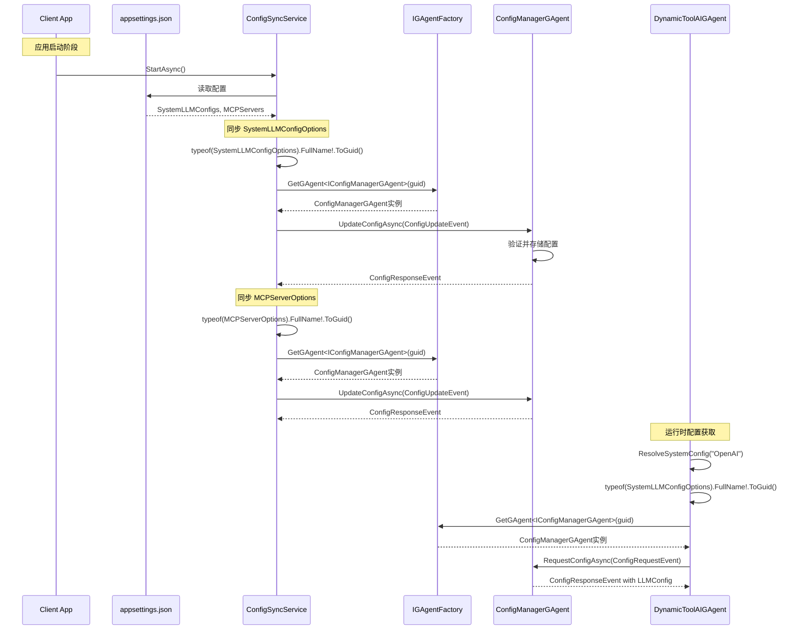
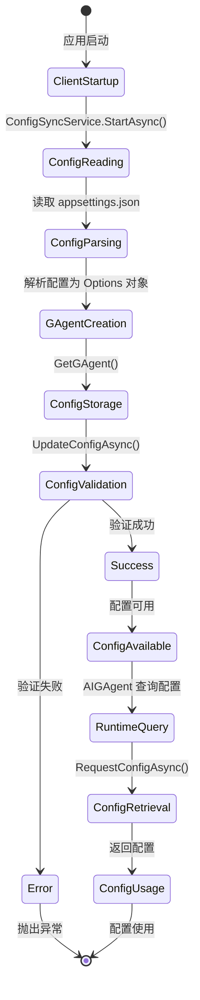

# 配置同步架构文档

## 概述

本文档详细描述了 Aevatar Workshop 中从 Client 同步配置到 Host 的完整架构和流程。该架构基于 Orleans GAgent 框架，通过 ConfigManagerGAgent 实现分布式配置存储，并通过 AIGAgentBase 的扩展点提供配置获取机制。

## 架构组件

### 1. ConfigManagerGAgent
- **职责**：作为配置存储的中心化 GAgent，每个实例管理一种特定类型的配置（如 SystemLLMConfigOptions、MCPServerOptions）
- **特性**：
  - 支持 Event Sourcing，记录所有配置变更
  - 使用确定性 GUID 生成（基于配置类型的 FullName）
  - 支持完整配置和部分配置键的查询

### 2. ConfigSyncService
- **职责**：在 Client 启动时读取本地配置并同步到 Host 的 ConfigManagerGAgent
- **特性**：
  - 作为 HostedService 在应用启动时自动执行
  - 支持多种配置类型的批量同步
  - 完整的错误处理和日志记录

### 3. AIGAgentBase 配置扩展点
- **GetLLMConfig()**：从配置源获取完整的 LLM 配置列表
- **ResolveSystemConfig(string key)**：根据 key 解析特定的 LLM 配置

## 配置同步流程



## 核心实现细节

### 1. 确定性 GUID 生成

使用 `ToGuid()` 扩展方法，基于配置类型的 FullName 生成确定性的 GUID：

```csharp
// 获取 SystemLLMConfigOptions 的 GUID
var configGuid = typeof(SystemLLMConfigOptions).FullName!.ToGuid();

// 获取对应的 ConfigManagerGAgent 实例
var configManager = _gAgentFactory.GetGAgent<IConfigManagerGAgent>(configGuid);
```

这确保了：
- 相同的配置类型总是映射到相同的 GAgent 实例
- 无需中央注册表或配置文件
- 跨服务和跨集群的一致性

### 2. ConfigSyncService 实现

```csharp
public async Task StartAsync(CancellationToken cancellationToken)
{
    try
    {
        // 同步 SystemLLMConfigOptions
        await SyncSystemLLMConfigsAsync();
        
        // 同步 MCPServerOptions
        await SyncMCPServersAsync();
        
        _logger.LogInformation("Configuration sync completed successfully");
    }
    catch (Exception ex)
    {
        _logger.LogError(ex, "Failed to sync configuration");
        throw;
    }
}

private async Task SyncSystemLLMConfigsAsync()
{
    var systemLLMConfigs = new SystemLLMConfigOptions();
    _configuration.GetSection("SystemLLMConfigs").Bind(systemLLMConfigs.LLMConfigs);
    
    if (systemLLMConfigs.LLMConfigs.Any())
    {
        var configGuid = typeof(SystemLLMConfigOptions).FullName!.ToGuid();
        var configManager = _gAgentFactory.GetGAgent<IConfigManagerGAgent>(configGuid);
        
        var updateEvent = new ConfigUpdateEvent
        {
            ConfigType = typeof(SystemLLMConfigOptions).FullName!,
            ConfigJson = JsonSerializer.Serialize(systemLLMConfigs.LLMConfigs)
        };
        
        var response = await configManager.UpdateConfigAsync(updateEvent);
        
        if (!response.Success)
        {
            _logger.LogError($"Failed to sync SystemLLMConfigs: {response.ErrorMessage}");
        }
    }
}
```

### 3. DynamicToolAIGAgent 配置获取

```csharp
protected override LLMConfig? ResolveSystemConfig(string key)
{
    try
    {
        var configGuid = typeof(SystemLLMConfigOptions).FullName!.ToGuid();
        var configManager = _gAgentFactory.GetGAgent<IConfigManagerGAgent>(configGuid);
        
        var requestEvent = new ConfigRequestEvent
        {
            ConfigType = typeof(SystemLLMConfigOptions).FullName!,
            ConfigKey = key
        };
        
        var response = configManager.RequestConfigAsync(requestEvent).GetAwaiter().GetResult();
        
        if (response.Success && !string.IsNullOrEmpty(response.ConfigJson))
        {
            return JsonConvert.DeserializeObject<LLMConfig>(response.ConfigJson);
        }
    }
    catch (Exception ex)
    {
        Logger.LogWarning(ex, $"Failed to resolve config from ConfigManagerGAgent for key: {key}");
    }
    
    // 回退到基础实现
    return base.ResolveSystemConfig(key);
}
```

## 配置文件示例

### appsettings.json
```json
{
  "SystemLLMConfigs": {
    "OpenAI": {
      "ProviderEnum": "OpenAI",
      "ModelIdEnum": "OpenAIGPT4",
      "DeploymentOrModelId": "gpt-4",
      "ApiKey": "your-api-key",
      "Temperature": 0.7
    },
    "DeepSeek": {
      "ProviderEnum": "OpenAI",
      "ModelIdEnum": "DeepSeekV3",
      "DeploymentOrModelId": "deepseek-chat",
      "Endpoint": "https://api.deepseek.com",
      "ApiKey": "your-deepseek-key"
    }
  },
  "MCPServers": [
    {
      "Name": "FileSystemServer",
      "TransportType": "SSE",
      "Endpoint": "http://localhost:3000/sse"
    }
  ]
}
```

## 状态流转图



## Event Sourcing 支持

ConfigManagerGAgent 通过 Event Sourcing 记录所有配置变更：

```csharp
// 配置设置事件
[GenerateSerializer]
public class ConfigSetLogEvent : ConfigManagerStateLogEvent
{
    [Id(0)] public string ConfigType { get; set; } = string.Empty;
    [Id(1)] public string ConfigJson { get; set; } = string.Empty;
    [Id(2)] public DateTime Timestamp { get; set; }
}

// 配置更新结果事件
[GenerateSerializer]
public class ConfigUpdatedLogEvent : ConfigManagerStateLogEvent
{
    [Id(0)] public string ConfigType { get; set; } = string.Empty;
    [Id(1)] public bool Success { get; set; }
    [Id(2)] public string? ErrorMessage { get; set; }
    [Id(3)] public DateTime Timestamp { get; set; }
    [Id(4)] public string ConfigJson { get; set; } = string.Empty;
}
```

这提供了：
- 完整的配置变更历史
- 审计日志功能
- 故障恢复能力
- 配置版本追踪

## 最佳实践

### 1. 配置类型设计
- 每种配置类型应该有明确的职责
- 使用强类型的 Options 类
- 保持配置结构的向后兼容性

### 2. 错误处理
- 在 ConfigSyncService 中实现重试机制
- 在 AIGAgent 中提供配置获取的回退策略
- 记录详细的错误日志

### 3. 性能优化
- 配置缓存策略（在 AIGAgent 级别）
- 批量同步配置以减少网络调用
- 使用异步方法避免阻塞

### 4. 安全考虑
- 敏感配置（如 API Key）应该使用 appsettings.secrets.json
- 考虑加密存储在 ConfigManagerGAgent 中的配置
- 实施访问控制和权限验证

## 扩展点

### 1. 自定义配置类型
要添加新的配置类型，只需：
1. 创建新的 Options 类
2. 在 ConfigSyncService 中添加同步逻辑
3. 在需要使用配置的 GAgent 中重写相应方法

### 2. 配置变更通知
可以扩展 ConfigManagerGAgent 以支持：
- 配置变更事件推送
- WebSocket 实时通知
- 配置版本控制

### 3. 配置验证
可以在 ConfigManagerGAgent 中添加：
- 配置架构验证
- 业务规则验证
- 配置依赖检查

## 总结

这个配置同步架构提供了一个健壮、可扩展的分布式配置管理解决方案。通过结合 Orleans GAgent 框架的强大功能和清晰的抽象设计，实现了配置的集中管理、版本控制和高效访问。 