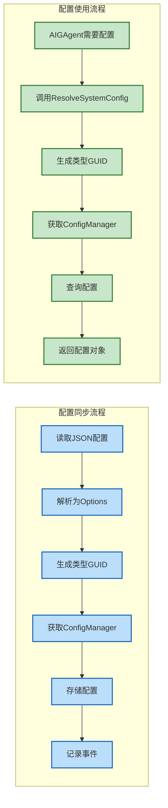
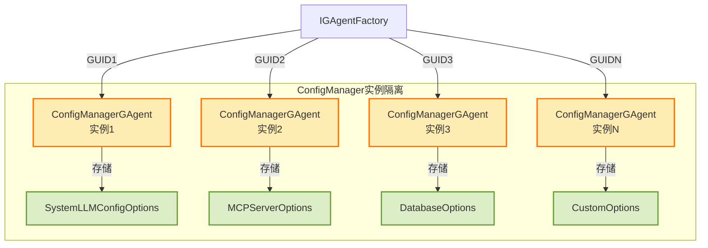
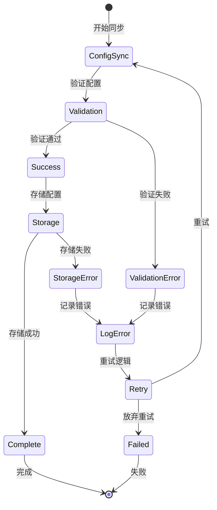
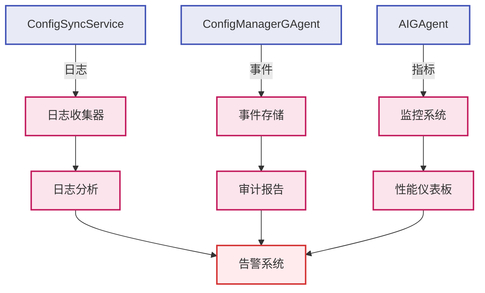

# 配置同步组件架构图

## 系统架构总览

```mermaid
graph TB
    subgraph "Client Application"
        A[appsettings.json<br/>配置文件] 
        B[ConfigSyncService<br/>配置同步服务]
        C[Client Startup<br/>客户端启动]
    end
    
    subgraph "Host/Orleans Cluster"
        D[IGAgentFactory<br/>GAgent工厂]
        E[ConfigManagerGAgent<br/>配置管理器]
        F[DynamicToolAIGAgent<br/>AI代理]
        G[Other GAgents<br/>其他代理]
    end
    
    subgraph "Configuration Types"
        H[SystemLLMConfigOptions<br/>LLM配置]
        I[MCPServerOptions<br/>MCP服务器配置]
        J[Other Options<br/>其他配置类型]
    end
    
    subgraph "Storage Layer"
        K[(GAgent State<br/>状态存储)]
        L[(Event Log<br/>事件日志)]
    end
    
    %% Client流程
    C -->|1. 启动时| B
    A -->|2. 读取配置| B
    B -->|3. 转换为Options对象| H
    B -->|3. 转换为Options对象| I
    B -->|3. 转换为Options对象| J
    
    %% 同步到Host
    B -->|4. ToGuid()生成ID| D
    D -->|5. 获取GAgent实例| E
    B -->|6. UpdateConfigAsync| E
    
    %% 存储
    E -->|7. Event Sourcing| K
    E -->|8. 记录变更| L
    
    %% 运行时使用
    F -->|9. ResolveSystemConfig| D
    D -->|10. 获取ConfigManager| E
    E -->|11. RequestConfigAsync| F
    G -->|查询配置| E
    
    %% 样式
    classDef client fill:#e1f5fe,stroke:#01579b,stroke-width:2px
    classDef host fill:#f3e5f5,stroke:#4a148c,stroke-width:2px
    classDef config fill:#e8f5e9,stroke:#1b5e20,stroke-width:2px
    classDef storage fill:#fff3e0,stroke:#e65100,stroke-width:2px
    
    class A,B,C client
    class D,E,F,G host
    class H,I,J config
    class K,L storage
```

## 组件职责详解

### Client端组件

#### 1. appsettings.json
```json
{
  "SystemLLMConfigs": {
    // LLM提供商配置
  },
  "MCPServers": [
    // MCP服务器配置
  ]
}
```

#### 2. ConfigSyncService
- **触发时机**: 应用启动时作为HostedService自动执行
- **主要职责**:
  - 读取本地配置文件
  - 将配置转换为强类型Options对象
  - 通过ToGuid()生成确定性ID
  - 调用ConfigManagerGAgent存储配置

### Host端组件

#### 1. IGAgentFactory
- **职责**: 管理GAgent实例的创建和获取
- **关键方法**: `GetGAgent<T>(Guid id)`

#### 2. ConfigManagerGAgent
- **存储模式**: 每个实例管理一种配置类型
- **关键特性**:
  - Event Sourcing支持
  - 配置验证
  - 部分键查询
  - 版本追踪

#### 3. AIGAgent配置集成
- **GetLLMConfig()**: 获取完整LLM配置列表
- **ResolveSystemConfig(key)**: 获取特定配置

## 数据流向图



## GUID生成机制

```mermaid
graph TD
    A[配置类型<br/>e.g. SystemLLMConfigOptions] 
    B[获取FullName<br/>"Aevatar.GAgents.AI.Options.SystemLLMConfigOptions"]
    C[ToGuid()扩展方法<br/>MD5哈希计算]
    D[确定性GUID<br/>e.g. "3f2504e0-4f89-11d3-9a0c-0305e82c3301"]
    E[ConfigManagerGAgent实例<br/>Primary Key = GUID]
    
    A --> B
    B --> C
    C --> D
    D --> E
    
    %% 样式
    classDef process fill:#e1bee7,stroke:#6a1b9a,stroke-width:2px
    class A,B,C,D,E process
```

## 配置类型隔离



## 错误处理流程



## 性能优化策略

### 1. 批量同步
```csharp
// 并行同步多种配置类型
var tasks = new List<Task>
{
    SyncSystemLLMConfigsAsync(),
    SyncMCPServersAsync(),
    SyncDatabaseConfigAsync()
};
await Task.WhenAll(tasks);
```

### 2. 配置缓存
```csharp
// 在AIGAgent中缓存配置
private readonly ConcurrentDictionary<string, LLMConfig> _configCache = new();

protected override LLMConfig? ResolveSystemConfig(string key)
{
    return _configCache.GetOrAdd(key, k => 
    {
        // 从ConfigManagerGAgent获取配置
    });
}
```

### 3. 懒加载
```csharp
// 只在需要时获取配置
private Lazy<IConfigManagerGAgent> _configManager = new(() =>
{
    var guid = typeof(SystemLLMConfigOptions).FullName!.ToGuid();
    return _gAgentFactory.GetGAgent<IConfigManagerGAgent>(guid);
});
```

## 监控和可观测性



## 总结

配置同步架构通过以下关键设计实现了高效、可靠的配置管理：

1. **类型安全**: 使用强类型Options确保配置正确性
2. **分布式友好**: 基于Orleans GAgent的分布式存储
3. **确定性路由**: ToGuid()确保配置总是路由到正确的实例
4. **事件溯源**: 完整的配置变更历史和审计能力
5. **扩展性强**: 易于添加新的配置类型和功能 