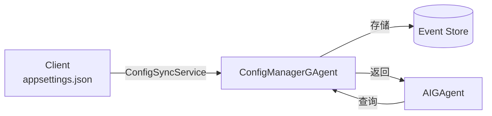

# 配置同步系统文档索引

## 📚 文档导航

欢迎来到 Aevatar Workshop 配置同步系统文档！这里汇总了所有相关文档，帮助您快速找到需要的信息。

## 🚀 快速开始

- [**配置同步快速入门指南**](./config-sync-quickstart.md)
  - 5分钟快速上手配置同步系统
  - 包含完整的示例代码和常见场景

## 📖 深入理解

- [**配置同步架构文档**](./config-sync-architecture.md)
  - 详细的架构设计说明
  - 核心组件详解
  - 配置同步流程图
  - Event Sourcing 支持

- [**配置同步组件架构图**](./config-sync-component-diagram.md)
  - 可视化的系统架构图
  - 组件关系和数据流向
  - 性能优化策略
  - 监控和可观测性

## 🔧 实现细节

### 核心组件源码

1. **ConfigManagerGAgent**
   - 位置: `src/Aevatar.Workshop.GAgent/ConfigManagerGAgent.cs`
   - 职责: 分布式配置存储和管理

2. **ConfigSyncService**
   - 位置: `src/Aevatar.Workshop.Client/Services/ConfigSyncService.cs`
   - 职责: 启动时同步配置到Host

3. **DynamicToolAIGAgent**
   - 位置: `src/Aevatar.Workshop.GAgent/GAgents/DynamicToolAIGAgent.cs`
   - 示例: 展示如何重写配置获取方法

## 🎯 核心特性

### 1. 类型安全的配置管理
- 每种配置类型独立存储
- 使用强类型 Options 对象
- 编译时类型检查

### 2. 确定性路由
- 使用 `ToGuid()` 扩展方法生成确定性GUID
- 无需中央注册表
- 跨集群一致性

### 3. Event Sourcing
- 完整的配置变更历史
- 审计日志功能
- 配置版本追踪

### 4. 分布式友好
- 基于 Orleans GAgent 框架
- 支持集群部署
- 高可用性设计

## 📊 架构概览

## 🛠️ 使用场景

1. **LLM配置管理**
   - 多模型配置支持
   - 动态切换模型
   - API密钥管理

2. **MCP服务器配置**
   - 动态服务器注册
   - 连接参数管理
   - 服务发现

3. **自定义配置类型**
   - 数据库连接
   - 第三方服务
   - 应用参数

## 📝 最佳实践

1. **配置组织**
   - 按功能分组配置
   - 使用有意义的键名
   - 保持配置结构简洁

2. **安全性**
   - 敏感信息使用 secrets.json
   - 考虑加密存储
   - 实施访问控制

3. **性能**
   - 实现配置缓存
   - 批量同步操作
   - 使用懒加载模式

## 🔍 故障排查

常见问题和解决方案请参考[快速入门指南的故障排查部分](./config-sync-quickstart.md#故障排查)。

## 📈 扩展和定制

- 添加新的配置类型
- 实现配置变更通知
- 集成外部配置源
- 自定义验证逻辑

## 🤝 贡献指南

如果您想为配置同步系统贡献代码或文档：

1. 遵循现有的代码风格
2. 添加适当的单元测试
3. 更新相关文档
4. 提交清晰的PR说明

## 📞 获取帮助

- 查看示例代码: `test/Aevatar.Workshop.Tests/ConfigSyncServiceTests.cs`
- 提交问题: 在项目仓库创建Issue
- 社区讨论: 加入开发者社区

---

*最后更新: 2024年12月* 