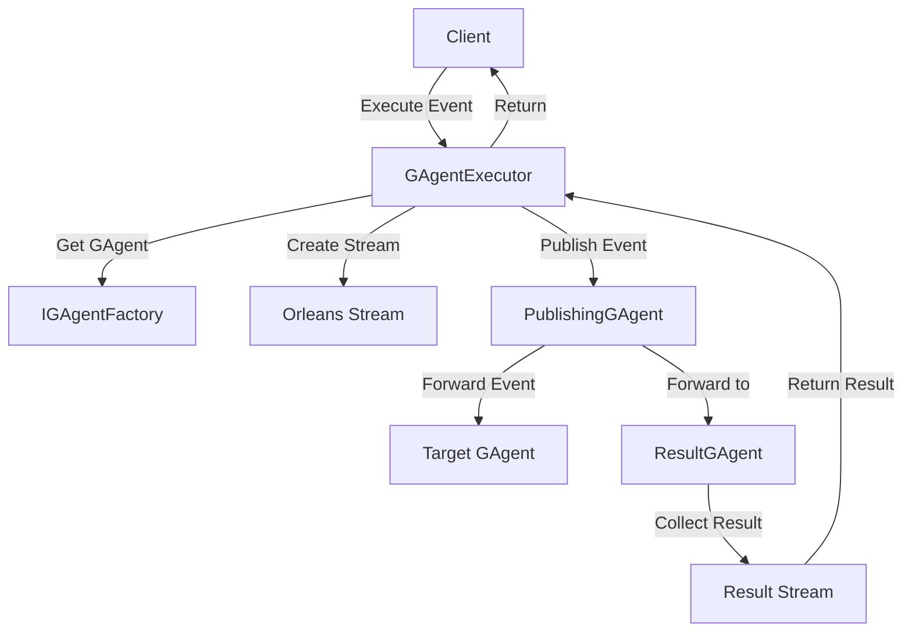

# GAgentExecutor Documentation

## Overview / 概述

GAgentExecutor is a core component in the Aevatar Workshop framework that facilitates the execution of GAgent event handlers. It provides a streamlined way to invoke event processing on GAgents while handling the complexities of distributed execution, result collection, and timeout management.

GAgentExecutor 是 Aevatar Workshop 框架中的核心组件，用于执行 GAgent 事件处理器。它提供了一种简化的方式来调用 GAgent 上的事件处理，同时处理分布式执行、结果收集和超时管理的复杂性。

## Key Features / 核心功能

- **Event Handler Execution**: Execute event handlers on specific GAgent instances
- **Result Collection**: Automatically collect and return execution results through streams
- **Timeout Management**: Built-in 5-minute timeout to prevent hanging operations
- **Flexible Targeting**: Support execution by GrainId or GrainType
- **Stream-based Communication**: Leverages Orleans streams for reliable result delivery

- **事件处理器执行**：在特定的 GAgent 实例上执行事件处理器
- **结果收集**：通过流自动收集并返回执行结果
- **超时管理**：内置 5 分钟超时机制，防止操作挂起
- **灵活的目标定位**：支持通过 GrainId 或 GrainType 执行
- **基于流的通信**：利用 Orleans 流实现可靠的结果传递

## Architecture / 架构



## How It Works / 工作原理

1. **Initialization**: GAgentExecutor creates a unique execution ID and sets up a result stream
2. **GAgent Resolution**: Uses IGAgentFactory to get the target GAgent, ResultGAgent, and PublishingGAgent
3. **Stream Setup**: Creates a subscription to monitor for execution completion
4. **Event Publishing**: PublishingGAgent forwards the event to both the target GAgent and ResultGAgent
5. **Result Collection**: ResultGAgent processes the execution result and publishes it to the stream
6. **Timeout Handling**: If no result is received within 5 minutes, a TimeoutException is thrown

1. **初始化**：GAgentExecutor 创建唯一的执行 ID 并设置结果流
2. **GAgent 解析**：使用 IGAgentFactory 获取目标 GAgent、ResultGAgent 和 PublishingGAgent
3. **流设置**：创建订阅以监控执行完成
4. **事件发布**：PublishingGAgent 将事件转发给目标 GAgent 和 ResultGAgent
5. **结果收集**：ResultGAgent 处理执行结果并将其发布到流
6. **超时处理**：如果在 5 分钟内未收到结果，将抛出 TimeoutException

## API Reference / API 参考

### IGAgentExecutor Interface

```csharp
public interface IGAgentExecutor
{
    Task<string> ExecuteGAgentEventHandler(GrainId grainId, EventBase @event);
    Task<string> ExecuteGAgentEventHandler(GrainType grainType, EventBase @event);
}
```

### Methods / 方法

#### ExecuteGAgentEventHandler(GrainId, EventBase)
Executes an event handler on a specific GAgent instance identified by GrainId.

在由 GrainId 标识的特定 GAgent 实例上执行事件处理器。

**Parameters / 参数:**
- `grainId`: The unique identifier of the target GAgent / 目标 GAgent 的唯一标识符
- `@event`: The event to be processed / 要处理的事件

**Returns / 返回:** 
- `Task<string>`: The execution result as a string / 以字符串形式返回的执行结果

#### ExecuteGAgentEventHandler(GrainType, EventBase)
Executes an event handler on a new GAgent instance of the specified type.

在指定类型的新 GAgent 实例上执行事件处理器。

**Parameters / 参数:**
- `grainType`: The type of GAgent to create and execute on / 要创建和执行的 GAgent 类型
- `@event`: The event to be processed / 要处理的事件

**Returns / 返回:**
- `Task<string>`: The execution result as a string / 以字符串形式返回的执行结果

## Usage Examples / 使用示例

### Basic Usage / 基础用法

```csharp
// Inject dependencies / 注入依赖
public class MyService
{
    private readonly IGAgentExecutor _gAgentExecutor;
    private readonly IGAgentFactory _gAgentFactory;

    public MyService(IGAgentExecutor gAgentExecutor, IGAgentFactory gAgentFactory)
    {
        _gAgentExecutor = gAgentExecutor;
        _gAgentFactory = gAgentFactory;
    }

    // Execute by GrainType / 通过 GrainType 执行
    public async Task ExecuteByTypeExample()
    {
        var grainType = GrainType.Create("EventHandlerDemoGAgent");
        var greetingEvent = new GreetingEvent 
        { 
            Greeting = "Hello, Aevatar!" 
        };
        
        var result = await _gAgentExecutor.ExecuteGAgentEventHandler(grainType, greetingEvent);
        Console.WriteLine($"Execution result: {result}");
    }

    // Execute by GrainId / 通过 GrainId 执行
    public async Task ExecuteByIdExample()
    {
        var grainId = GrainId.Create(
            GrainType.Create("EventHandlerDemoGAgent"), 
            Guid.NewGuid().ToString()
        );
        
        var greetingEvent = new GreetingEvent 
        { 
            Greeting = "Hello from specific instance!" 
        };
        
        var result = await _gAgentExecutor.ExecuteGAgentEventHandler(grainId, greetingEvent);
        Console.WriteLine($"Execution result: {result}");
    }
}
```

### Unit Testing Example / 单元测试示例

```csharp
[Fact]
public async Task ExecuteGAgentEventHandler_ShouldProcessEvent()
{
    // Arrange
    var targetGAgent = await _gAgentFactory.GetGAgentAsync<IStateGAgent<EventHandlerDemoGAgentState>>();
    var grainId = targetGAgent.GetGrainId();
    
    var greetingEvent = new GreetingEvent
    {
        Greeting = "Test greeting!"
    };

    // Act
    var result = await _gAgentExecutor.ExecuteGAgentEventHandler(grainId, greetingEvent);

    // Assert
    result.ShouldNotBeNull();
    result.ShouldContain(greetingEvent.Greeting);
    
    // Verify state was updated
    var state = await targetGAgent.GetStateAsync();
    state.Content.ShouldContain(greetingEvent.Greeting);
}
```

## Events and Result Handling / 事件和结果处理

### ExecutionCompletedEvent

The GAgentExecutor uses `ExecutionCompletedEvent` internally to communicate execution results:

GAgentExecutor 内部使用 `ExecutionCompletedEvent` 来传递执行结果：

```csharp
[GenerateSerializer]
public class ExecutionCompletedEvent
{
    [Id(0)] public string ExecutionId { get; set; } = string.Empty;
    [Id(1)] public string Result { get; set; } = string.Empty;
}
```

## Configuration / 配置

### Dependency Injection / 依赖注入

Register GAgentExecutor in your service configuration:

在服务配置中注册 GAgentExecutor：

```csharp
services.AddTransient<IGAgentExecutor, GAgentExecutor>();
```

### Stream Provider / 流提供程序

GAgentExecutor uses the default Aevatar stream provider:

GAgentExecutor 使用默认的 Aevatar 流提供程序：

- Provider Name: `AevatarCoreConstants.StreamProvider`
- Namespace: `GAgentPluginConstants.GAgentPluginStreamNamespace`

## Best Practices / 最佳实践

1. **Error Handling**: Always wrap executor calls in try-catch blocks to handle TimeoutException
   **错误处理**：始终将执行器调用包装在 try-catch 块中以处理 TimeoutException

2. **Timeout Consideration**: The default 5-minute timeout is suitable for most operations, but consider your specific use case
   **超时考虑**：默认的 5 分钟超时适用于大多数操作，但请考虑您的具体用例

3. **Event Design**: Keep events small and focused on a single responsibility
   **事件设计**：保持事件小巧且专注于单一职责

4. **State Verification**: After execution, verify the GAgent state if needed
   **状态验证**：执行后，如需要可验证 GAgent 状态

5. **Reusability**: Reuse GAgentExecutor instances; they are thread-safe
   **可重用性**：重用 GAgentExecutor 实例；它们是线程安全的

## Troubleshooting / 故障排除

### Common Issues / 常见问题

1. **TimeoutException**
   - Cause: Event handler takes longer than 5 minutes
   - Solution: Optimize event handler logic or consider async processing
   - 原因：事件处理器执行超过 5 分钟
   - 解决方案：优化事件处理器逻辑或考虑异步处理

2. **Service Resolution Errors**
   - Cause: IGAgentFactory not registered in DI container
   - Solution: Ensure proper service registration in startup
   - 原因：IGAgentFactory 未在 DI 容器中注册
   - 解决方案：确保在启动时正确注册服务

3. **Stream Connection Issues**
   - Cause: Stream provider not configured correctly
   - Solution: Verify Orleans stream configuration
   - 原因：流提供程序配置不正确
   - 解决方案：验证 Orleans 流配置

## Integration with Plugin System / 与插件系统的集成

GAgentExecutor is a key component in the GAgent plugin system, enabling dynamic execution of event handlers loaded from plugins. When used with the plugin system:

GAgentExecutor 是 GAgent 插件系统中的关键组件，支持从插件加载的事件处理器的动态执行。与插件系统一起使用时：

1. Plugins can define custom GAgents with event handlers
2. GAgentExecutor can execute these handlers without compile-time knowledge
3. Results are collected and returned in a standardized format

1. 插件可以定义带有事件处理器的自定义 GAgent
2. GAgentExecutor 可以在没有编译时知识的情况下执行这些处理器
3. 结果以标准化格式收集和返回

## Performance Considerations / 性能考虑

- **Stream Overhead**: Each execution creates a new stream subscription, which has minimal overhead
- **Timeout Trade-off**: The 5-minute timeout provides safety but may be too long for high-frequency operations
- **Concurrent Executions**: Multiple executions can run concurrently without interference

- **流开销**：每次执行都会创建新的流订阅，开销很小
- **超时权衡**：5 分钟超时提供了安全性，但对于高频操作可能太长
- **并发执行**：多个执行可以并发运行而不会相互干扰

## Future Enhancements / 未来增强

Potential improvements being considered:

正在考虑的潜在改进：

- Configurable timeout values / 可配置的超时值
- Batch execution support / 批量执行支持
- Execution metrics and monitoring / 执行指标和监控
- Custom result serialization / 自定义结果序列化
- Retry mechanisms / 重试机制

## Related Components / 相关组件

- **IGAgentFactory**: Creates and manages GAgent instances / 创建和管理 GAgent 实例
- **IPublishingGAgent**: Handles event distribution / 处理事件分发
- **IResultGAgent**: Collects and reports execution results / 收集和报告执行结果
- **EventBase**: Base class for all events / 所有事件的基类

---

*This documentation reflects the current implementation of GAgentExecutor in the Aevatar Workshop framework. For the latest updates, refer to the source code and unit tests.*

*本文档反映了 Aevatar Workshop 框架中 GAgentExecutor 的当前实现。有关最新更新，请参考源代码和单元测试。*