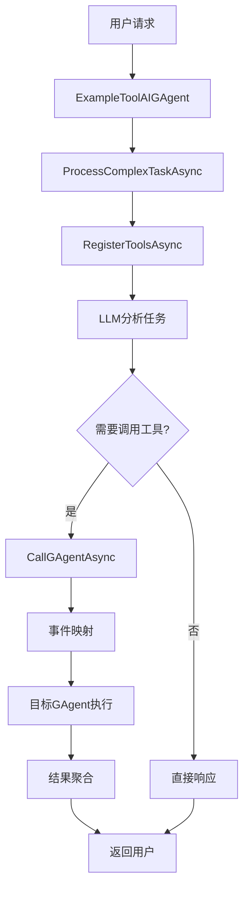
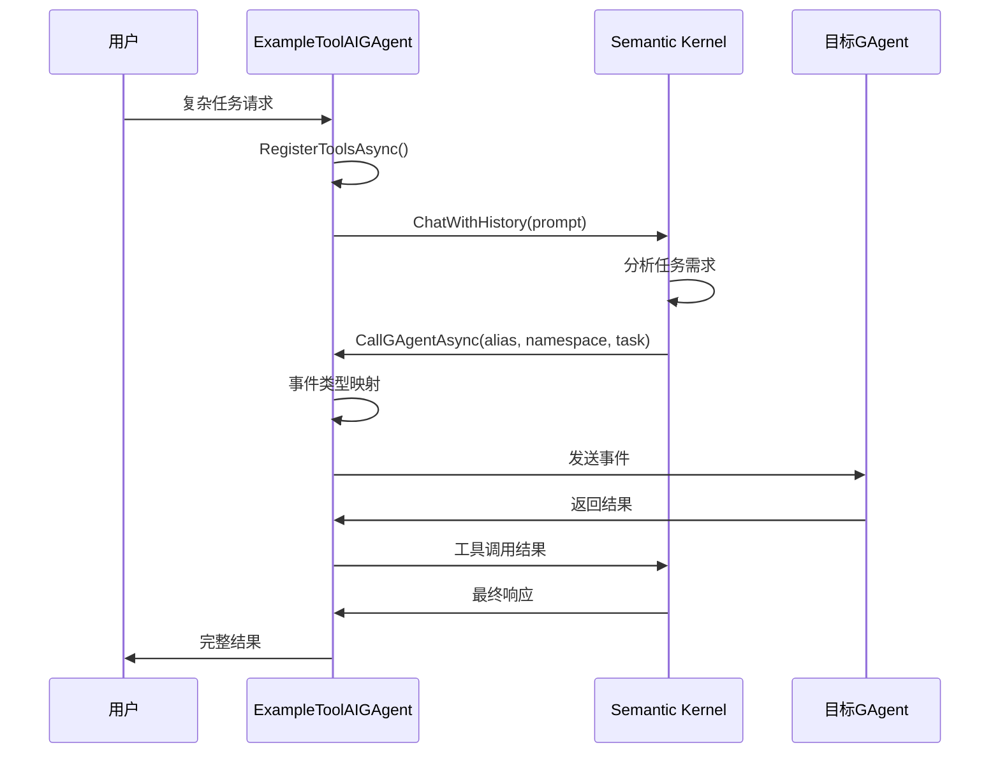
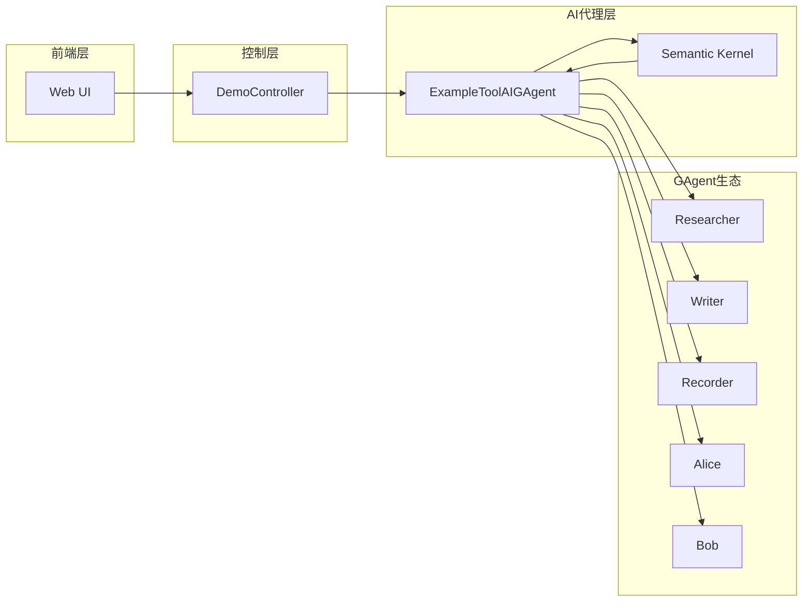

 # ToolAIGAgent 技术文档

## 概述

ToolAIGAgent 是一个创新的AI代理架构，旨在让大语言模型（LLM）能够智能地调用系统中的其他GAgent来完成复杂任务。它通过Semantic Kernel的工具调用机制，实现了LLM与多代理系统的无缝集成。

### 核心特性

- 🤖 **智能工具调用**：LLM可以自主决定调用哪个GAgent
- 🔗 **统一接口**：单一工具接口调用所有GAgent
- 📝 **详细描述**：为LLM提供完整的GAgent功能说明
- ⚡ **自动映射**：智能的事件类型映射机制
- 🔄 **任务协调**：多步骤任务的智能编排

## 架构设计

### 整体架构

```
用户请求 → ExampleToolAIGAgent → Semantic Kernel → CallGAgentAsync → 目标GAgent → 结果返回
```

### 核心组件

1. **ExampleToolAIGAgent**：继承自AIGAgentBase的工具AI代理
2. **CallGAgentAsync**：标记为KernelFunction的工具方法
3. **RegisterToolsAsync**：工具注册管理器
4. **事件映射系统**：自动选择合适的事件类型

## 实现思路

### 1. 统一工具接口设计

传统方案是为每个功能创建独立工具（research、write、record），我们采用了统一接口方案：

```csharp
[KernelFunction]
[Description("Call any GAgent in the system...")]
public virtual async Task<string> CallGAgentAsync(
    string alias,
    string namespaceName, 
    string task)
```

**优势**：
- 简化LLM的学习成本
- 统一的调用模式
- 易于扩展新的GAgent

### 2. 智能事件映射

根据目标GAgent自动选择合适的事件类型：

```csharp
EventBase eventToSend = alias.ToLower() switch
{
    "researcher" => new GreetingEvent { Greeting = $"Research: {task}" },
    "writer" => new GreetingEvent { Greeting = $"Write: {task}" },
    "recorder" => new RecordEvent { Message = task },
    _ => new GreetingEvent { Greeting = task }
};
```

### 3. 详细的工具描述

在KernelFunction的Description中提供完整的GAgent列表：

```
🔬 researcher.demo - Research and information gathering
✍️ writer.demo - Content creation and writing  
📝 recorder.demo - Information logging and recording
💬 alice.demo - Interactive conversation
🎮 bob.demo - Games and logical reasoning
🤖 exampleToolAI.demo - Complex task coordination
```

## 流程图

### 主要交互流程



### 工具调用详细流程



### 系统架构图



## 核心功能详解

### 1. 工具注册机制

```csharp
protected virtual async Task RegisterToolsAsync()
{
    if (_toolsRegistered) return;
    
    try
    {
        // 使用KernelFunction注解的方式，工具会自动被Semantic Kernel发现
        _toolsRegistered = true;
        Logger.LogInformation("Tools registered successfully to Semantic Kernel");
    }
    catch (Exception ex)
    {
        Logger.LogError(ex, "Failed to register tools to Semantic Kernel");
        throw;
    }
}
```

### 2. LLM提示词设计

```csharp
var prompt = $"""
    You are an intelligent AI agent that can coordinate with other agents to complete complex tasks.
    
    Current task: {task}
    
    You have access to the call_gagent tool which can call any of the following GAgents:
    - researcher.demo: For research and information gathering
    - writer.demo: For content creation and writing
    - recorder.demo: For logging and recording information
    - alice.demo: For interactive conversations
    - bob.demo: For games and logical reasoning
    - exampleToolAI.demo: For complex task coordination
    
    Analyze this task and determine what steps are needed. Use the call_gagent tool to delegate work to appropriate agents.
    Coordinate the results and provide a comprehensive response.
    """;
```

### 3. 状态管理

```csharp
[GenerateSerializer]
public class ExampleToolAIGAgentState : AIGAgentStateBase
{
    [Id(0)] public List<string> TaskHistory { get; set; } = [];
    [Id(1)] public string CurrentTask { get; set; } = string.Empty;
}
```

## 使用示例

### 基本用法

```csharp
// 1. 创建ToolAIGAgent实例
var toolAI = new ExampleToolAIGAgent(gAgentFactory, clusterClient);

// 2. 处理复杂任务
var result = await toolAI.ProcessComplexTaskAsync(
    "研究人工智能的发展历史，并写一篇技术博客"
);
```

### 前端集成

```javascript
// 调用ToolAIGAgent Demo
fetch('/api/demo/run', {
    method: 'POST',
    headers: { 'Content-Type': 'application/json' },
    body: JSON.stringify({
        mode: 4,  // ToolAIGAgent模式
        task: "分析市场趋势并生成报告"
    })
});
```

## 技术细节

### Semantic Kernel集成

1. **KernelFunction注解**：自动工具发现
2. **Description属性**：为LLM提供工具说明
3. **参数描述**：详细的参数使用指南

### 事件系统集成

1. **EventBase继承**：统一的事件基类
2. **类型映射**：智能的事件类型选择
3. **异步处理**：非阻塞的事件处理机制

### 日志和监控

```csharp
Logger.LogInformation($"Calling GAgent: {alias}.{namespaceName} with task: {task}");
Logger.LogInformation("Complex task completed: {Task}", task);
```

## 性能优化

### 1. 工具注册缓存

使用`_toolsRegistered`标志避免重复注册：

```csharp
if (_toolsRegistered) return;
```

### 2. 异步事件处理

```csharp
RaiseEvent(new NewTaskStateLogEvent { Task = task });
await ConfirmEvents();
```

### 3. 错误处理

```csharp
try
{
    // 工具调用逻辑
}
catch (Exception ex)
{
    Logger.LogError(ex, $"Error calling GAgent: {alias}.{namespaceName}");
    return $"Failed to call {alias}.{namespaceName}: {ex.Message}";
}
```

## 扩展性设计

### 添加新的GAgent

1. 在工具描述中添加新的GAgent信息
2. 在事件映射中添加相应的映射规则
3. 无需修改核心调用逻辑

### 自定义事件类型

```csharp
"newagent" => new CustomEvent { Data = task },
```

### 工具功能扩展

可以轻松添加新的KernelFunction工具方法。

## 动态实现（已完成）

### 1. 动态GAgent发现

系统现在能够自动发现所有带有`[GAgent]`特性的GAgent：

```csharp
protected virtual async Task<Dictionary<string, GAgentInfo>> DiscoverGAgentsAsync()
{
    var gAgentType = typeof(IGAgent);
    var assemblies = AppDomain.CurrentDomain.GetAssemblies();
    
    // 扫描所有程序集中的GAgent
    foreach (var assembly in assemblies)
    {
        var types = assembly.GetTypes()
            .Where(t => gAgentType.IsAssignableFrom(t) && 
                       t.IsClass && 
                       !t.IsAbstract &&
                       t.GetCustomAttribute<GAgentAttribute>() != null);
        // 收集GAgent信息...
    }
}
```

### 2. 智能事件类型推断

通过反射分析EventHandler方法，自动推断合适的事件类型：

```csharp
protected virtual async Task<EventBase> CreateEventForGAgentAsync(GAgentInfo gagentInfo, string task)
{
    // 分析GAgent的EventHandler方法
    var eventHandlerMethods = gagentInfo.Type.GetMethods()
        .Where(m => m.GetCustomAttribute<EventHandlerAttribute>() != null);
        
    // 获取事件类型并创建实例
    var eventType = parameters[0].ParameterType;
    var eventInstance = Activator.CreateInstance(eventType) as EventBase;
    
    // 智能设置属性
    SetEventProperties(eventInstance, task);
}
```

### 3. 使用GAgentExecutor执行

真正的GAgent调用通过GAgentExecutor实现：

```csharp
var grainType = GrainType.Create(GenerateGrainTypeName(gagentInfo));
var result = await _gAgentExecutor.ExecuteGAgentEventHandler(grainType, eventToSend);
```

### 4. 动态工具描述生成

根据发现的GAgent动态生成工具描述：

```csharp
protected virtual string BuildToolDescription()
{
    foreach (var gagent in _availableGAgents.Values)
    {
        sb.AppendLine($"{icon} {gagent.Key} - {gagent.Description}");
    }
}
```

## 架构优势

### 1. 完全动态化

- 无需硬编码GAgent列表
- 新增GAgent自动被发现
- 描述信息动态获取

### 2. 智能事件映射

- 自动分析EventHandler签名
- 智能创建正确的事件类型
- 支持JSON格式的复杂事件数据

### 3. 真实执行

- 使用GAgentExecutor执行真实调用
- 支持超时和错误处理
- 返回实际执行结果

## 未来优化方向

### 1. 结果缓存机制

缓存常见任务的执行结果，提高响应速度。

### 2. 并行任务执行

支持同时调用多个GAgent并行处理任务。

### 3. 更智能的事件构造

- 支持复杂的事件类型推断
- 基于历史调用学习事件模式
- 支持多参数的EventHandler

### 4. 权限控制

- 集成权限管理系统
- 控制哪些GAgent可以被LLM调用
- 基于角色的访问控制

## 总结

ToolAIGAgent代表了AI代理系统的一个重要进步，它成功地将LLM的推理能力与多代理系统的专业能力结合起来。通过统一的工具接口、智能的事件映射和详细的功能描述，ToolAIGAgent为构建复杂的AI应用提供了强大的基础架构。

### 关键成就

- ✅ **统一工具调用**：简化了LLM与多代理系统的交互
- ✅ **智能任务分解**：LLM可以自主决定如何分解和分配任务
- ✅ **扩展性设计**：易于添加新的GAgent和功能
- ✅ **完整集成**：与Semantic Kernel和Orleans的无缝集成
- ✅ **动态发现机制**：自动发现系统中所有可用的GAgent
- ✅ **真实执行能力**：通过GAgentExecutor执行真实的GAgent调用
- ✅ **智能事件推断**：自动分析并创建正确的事件类型

### 技术价值

ToolAIGAgent不仅解决了LLM调用外部工具的技术问题，更重要的是提供了一种新的AI应用架构模式。通过动态发现和智能映射机制，系统能够自适应地扩展功能，为构建更智能、更灵活的AI系统奠定了基础。

### 新架构的核心优势

1. **零配置扩展**：新增GAgent无需修改ToolAIGAgentBase代码
2. **类型安全**：通过反射确保事件类型匹配
3. **实时发现**：运行时动态发现所有可用GAgent
4. **智能适配**：自动适配不同的事件类型和参数结构
5. **真实交互**：不再是模拟，而是真正的GAgent执行

这种动态架构让ToolAIGAgent成为了一个真正的"通用工具调用框架"，为LLM与多代理系统的深度集成开辟了新的可能性。